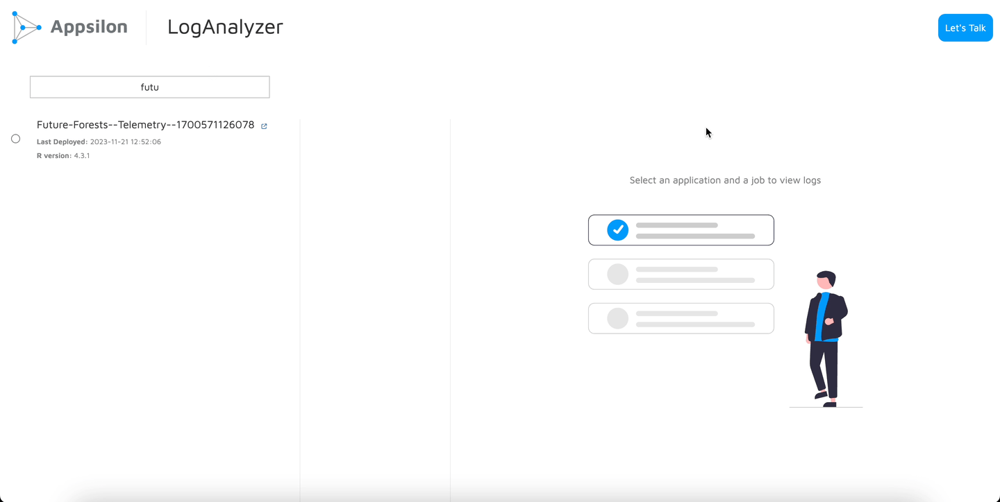

# LogAnalyzer

The LogAnalyzer open-source app is a simple, plug and play application developed first in collaboration with [Elkem](https://www.elkem.com/). The app provides an ability to get semantically coloured logs for applications deployed on Posit Connect by simply changing the default environment variables and deploying it on Posit Connect. Given the general usefulness of the app, we have decided to share it with the wider community to use and improve upon it. No more sifting through long text files; you can simply find the reds and see where things break. It has never been easier to investigate what goes wrong with your applications.

# How it works?

-   The LogAnalyzer app uses the Posit Connect API to fetch logs for application run jobs, semantically colouring them so they are easier to read.
-   The only thing you need to set this up and use is the `CONNECT_API_KEY` set as an environment variable. The idea is that the key should come from either an admin account or someone with privileges to view all apps. Apps that are not available to a user will not have their logs available to them.
-   If you want to test the app locally, you will need to set the `CONNECT_SERVER` as an environment variable. When deployed, the `CONNECT_SERVER` is setup automatically for you.

# Configuration

-   `[app/logic/api_utils.R` - `get_app_list()]` Posit Connect differentiates apps with two `app_role` values: `owner` and `viewer`. You can toggle between these using the `config.yml` file. The set value is `owner`. If you want to use both together, you can simply set the value to a blank character `""`.

# FAQs

- I get `"Oops! Can't read apps from Posit Connect."` on the rightmost image?
    - This may mean that the Posit Connect API's response did not send proper data.
    - So far, one documented reason for this is that OAuth on Posit Connect instances may prevent the `/content` endpoint from sending app data.

# Credits

It was our collaboration with  which led to the creation of this app. The initial idea came from use-cases where we realised we wanted to track all the logs and be able to read them properly since Posit Connect was the de facto deployment environment. When we made this app, we realised there was potential in sharing this with the rest of the community and invite everyone to use it and add it. We appreciate and thank Elkem for their openness to share it with the world.

You can read more about Appsilon and Elkem's collaboration on our case study [here](https://www.appsilon.com/case-studies/refining-elkems-processes-with-advanced-data-analytics).

## Appsilon

Appsilon is a **Posit (formerly RStudio) Full Service Certified Partner**.  Learn more at [appsilon.com](https://appsilon.com).

Get in touch [opensource\@appsilon.com](mailto:opensource@appsilon.com)

Explore the [Rhinoverse](https://rhinoverse.dev) - a family of R packages built around [Rhino](https://appsilon.github.io/rhino/)!

